  <h1> ɴ ᴀ ᴍ ᴇ ʟ ᴇ s s _ ᴠ ᴀ ᴍ ᴘ </h1>
  
  <h3>> ꜱʏꜱᴛᴇᴍ.ᴏɴʟɪɴᴇ // ᴄɪᴛɪᴢᴇɴ.ᴅᴇᴠ // ʀᴘᴀ.ᴀʀᴄʜɪᴛᴇᴄᴛ</h3>

   

  

    

  <samp>
  > USER: Vamp  
  > LVL: 22
  </samp>

    

  > *"We treat errors as data for evolution. Fail fast. Iterate faster."*

   

  ### // ᴀ ʀ s ᴇ ɴ ᴀ ʟ
  

    
    
    
    
   
    
  
    
    
   
    
   
  

   

  ### // ᴄ ᴜ ʀ ʀ ᴇ ɴ ᴛ _ ᴏ ʙ ᴊ ᴇ ᴄ ᴛ ɪ ᴠ ᴇ s

  | ID | P_N4M3 | STATUS | TYPE |
  | :--- | :--- | :--- | :--- |
  | 01 | **V.A.M.P.** | `[LOADING...]` | `Computer Vision` |
  | 02 | **PROJ3CT_R1FT** | `[DEV_MODE]` | `TCG Simulator` |

   

  

  
  

